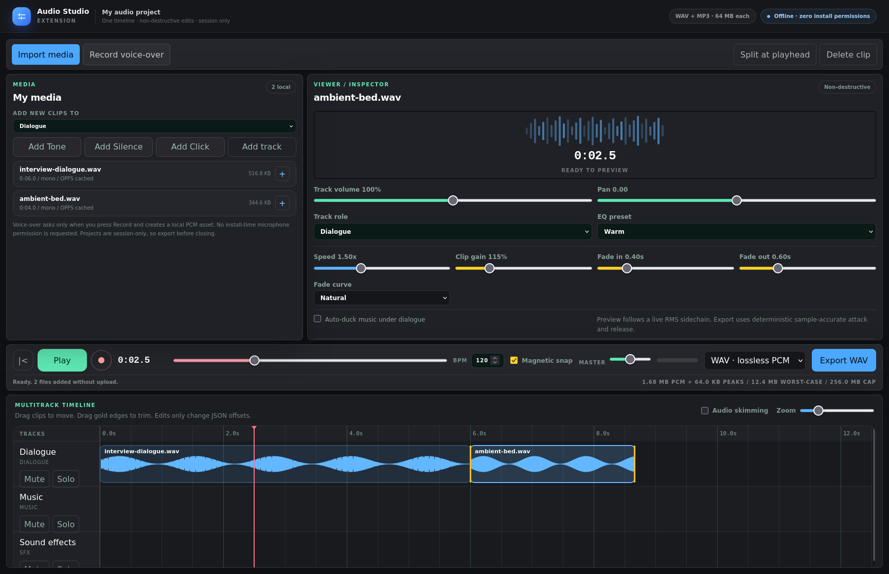
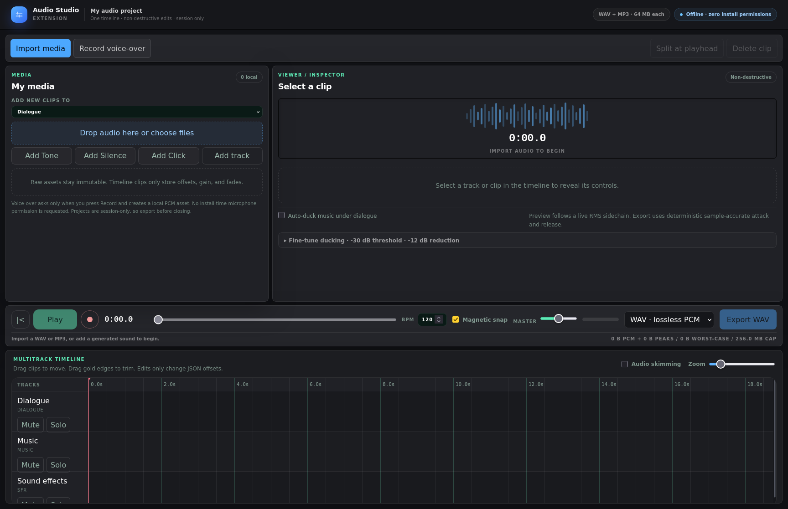
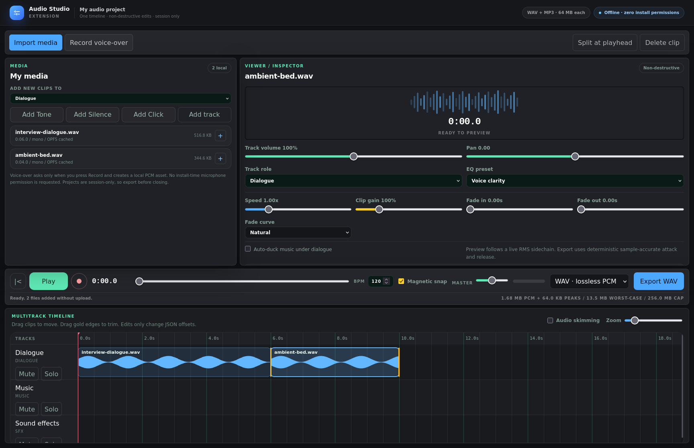
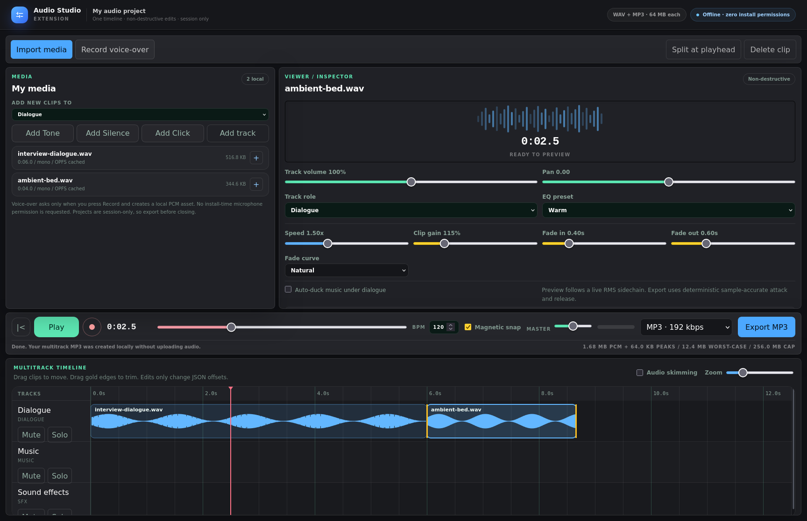
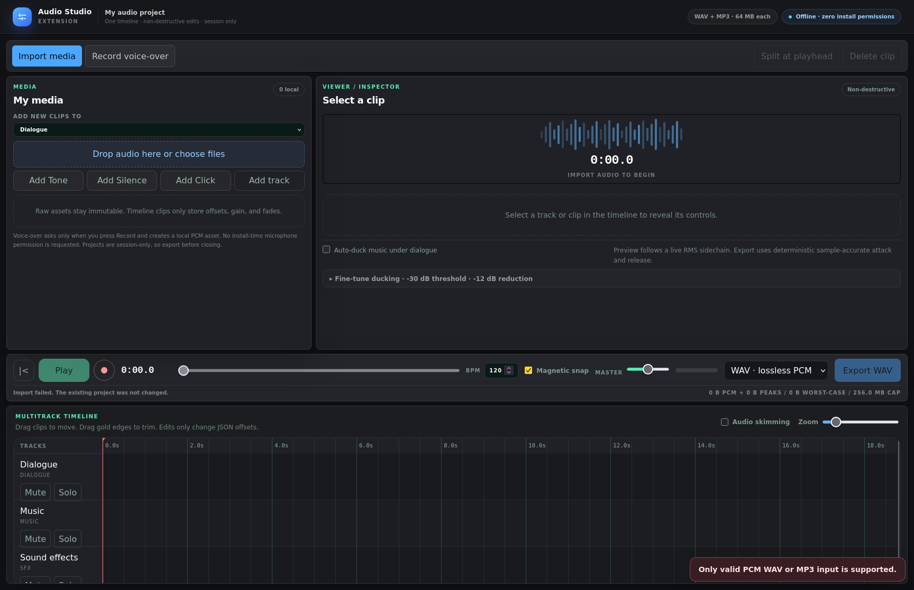

# Audio Studio

Audio Studio is the shipped flagship of the `media-tools` repository: a private, offline, iMovie-style WAV and MP3 workspace for Firefox and Chrome. Import audio once, edit everything on one timeline, and export the finished mix.



[](https://github.com/animeshkundu/media-tools/actions/workflows/ci.yml) [](https://github.com/animeshkundu/media-tools/actions/workflows/e2e.yml) [](LICENSE) [](https://github.com/animeshkundu/media-tools/releases)

[Security policy](./SECURITY.md) · [Changelog](./docs/CHANGELOG.md) · [Contributing](./CONTRIBUTING.md)

## The privacy promise

> **Your audio never leaves your device; no uploads, no accounts, no telemetry; all processing local.**

This rests first on what you can audit: Audio Studio declares zero install-time permissions, and its built bundle contains no network code. A CI check greps both browser builds for `fetch`, `XMLHttpRequest`, `WebSocket`, `sendBeacon`, and `EventSource` and fails the build if any appear. The strict no-egress content-security policy (`connect-src 'none'`) is defense in depth, blocking outbound connections from extension pages even if a bug were introduced; because a content-security policy does not restrict top-level navigation, it is not the sole line of defense. Source review verifies that the only `browser.tabs.create` call opens the extension's own app page through `browser.runtime.getURL` (same-origin) and never navigates to an external URL. The empty permission list and the CSP are also checked in CI against both built manifests. See [docs/PEER-REVIEW.md](docs/PEER-REVIEW.md) and [docs/CAPABILITY-CONTRACT.md](docs/CAPABILITY-CONTRACT.md).

## Permissions and CSP

Audio Studio ships with an empty permission list and a strict no-egress content-security policy. Both are checked in CI against the built Chrome and Firefox manifests on every change.

Declared permissions:

```json
"permissions": []
```

Extension-page content-security policy:

```
default-src 'none'; script-src 'self'; style-src 'self' 'unsafe-inline'; img-src 'self' data: blob:; media-src 'self' blob:; worker-src 'self'; connect-src 'none'; form-action 'none'; frame-src 'none'; object-src 'none'; base-uri 'none'
```

`connect-src 'none'` blocks outbound network connections from extension pages, `form-action 'none'` blocks form submissions, and `frame-src 'none'` blocks frames. Scripts, workers, media, images, and styles are limited to the explicitly listed bundled or in-page sources; object and embed content is disabled entirely. Saving audio uses a standard browser download from an in-page blob, so no `downloads` permission is requested. An empty permission list and a CSP are not a privacy proof by themselves, so the capability contract is verified through source review, the CI built-bundle scan for network primitives, both built manifests, and production-artifact tests. See [docs/PEER-REVIEW.md](docs/PEER-REVIEW.md) and [docs/CAPABILITY-CONTRACT.md](docs/CAPABILITY-CONTRACT.md).

## Features

- **Import once and edit together.** Reuse WAV/MP3 assets across clips without re-reading the same file or switching tools.
- **Arrange, trim, split, merge, zoom, and snap** on one non-destructive multitrack Canvas timeline.
- **Fine-tune every selection** with 0.25x–4x coupled speed/pitch, clip gain, fades, track volume/pan, EQ presets, mute/solo, and dialogue-driven music ducking.
- **Listen while editing** with local Web Audio preview, seeking, scrubbing, and opt-in audio skimming.
- **Record voice-over locally** after an explicit browser prompt; no microphone permission is requested at install time.
- **Export WAV or MP3** through a cancellable authoritative mixdown worker.
- **No uploads, accounts, ads, telemetry, or watermarks.** Audio input, processing, and output stay in the browser.
- **Bounded processing** with a 64 MiB input limit, 256 MiB decoded/in-flight PCM limits, mono/stereo validation, and a processing watchdog.
- **Cancellable worker jobs** with progress reporting and no partial download after cancellation or failure.
- **Accessible controls** for file selection, clip selection, keyboard nudging, exact inspector settings, status, and progress.
- **Real-Firefox end-to-end coverage** in CI, not browser emulation.
- **One MV3 codebase** for Chrome and Firefox.
- **Zero install-time permissions.**

## Screenshots

### Start with one workspace

The media library, viewer/inspector, transport, and multitrack timeline are visible from the first frame.



### Import once

Choose one or many local files. Each immutable source appears in the library and on the chosen track.



### Edit in context

Selection connects the inspector and timeline. Tune speed, gain, fades, EQ, placement, zoom, and playhead without changing source buffers.


### Export locally

Create the finished download in the browser without uploading the source audio.



### Friendly failures

Corrupt or unsupported audio fails with a clear message instead of a misleading download.



## Install

Audio Studio is a developer preview. Store listings are coming soon:

- **Firefox (AMO):** coming soon
- **Chrome (Chrome Web Store):** coming soon

Until then, use a package from [GitHub Releases](https://github.com/animeshkundu/media-tools/releases) when one is available. Release archives follow the exact pattern `audio-cutter-<version>-{chrome,firefox,sources}.zip`:

- **Chrome:** unzip `audio-cutter-<version>-chrome.zip`, open `chrome://extensions`, enable **Developer mode**, choose **Load unpacked**, and select the extracted folder.
- **Firefox:** open `about:debugging#/runtime/this-firefox`, choose **Load Temporary Add-on**, and select `audio-cutter-<version>-firefox.zip`. A temporary add-on is cleared when Firefox restarts; a signed AMO build for persistent installation is coming soon.
- **Sources:** `audio-cutter-<version>-sources.zip` contains the corresponding source package for review and independent builds.

## Verify your download

Download `audio-cutter-<version>-chrome.zip`, `audio-cutter-<version>-firefox.zip`, `audio-cutter-<version>-sources.zip`, and `SHA256SUMS` from the [Releases page](https://github.com/animeshkundu/media-tools/releases), then verify their checksums:

```sh
sha256sum -c SHA256SUMS
```

On macOS:

```sh
shasum -a 256 -c SHA256SUMS
```

Each asset also has a keyless GitHub OIDC signature bundle. Verify the checksum file before trusting it:

```sh
cosign verify-blob --new-bundle-format --bundle SHA256SUMS.sigstore.json --certificate-identity-regexp '^https://github\.com/animeshkundu/media-tools/\.github/workflows/release\.yml@refs/tags/v[^/]+$' --certificate-oidc-issuer https://token.actions.githubusercontent.com SHA256SUMS
```

To verify the ZIP bundles directly, replace `<version>` with the release version:

```sh
version='<version>'
for target in chrome firefox sources; do
  archive="audio-cutter-${version}-${target}.zip"
  cosign verify-blob --new-bundle-format --bundle "${archive}.sigstore.json" --certificate-identity-regexp '^https://github\.com/animeshkundu/media-tools/\.github/workflows/release\.yml@refs/tags/v[^/]+$' --certificate-oidc-issuer https://token.actions.githubusercontent.com "${archive}"
done
```

For an independent build comparison, check out the release tag, run `npm ci`, then `npm run zip` and `npm run zip:firefox`. Compare the generated ZIP SHA-256 values with `SHA256SUMS`, or compare the build inputs with `audio-cutter-<version>-sources.zip`. Byte-for-byte equality can depend on the local toolchain and packaging metadata.

## How it works

A durable extension app page owns the interface and operation lifetime. Page-owned Web Workers analyze and decode WAV/MP3 input and perform final WAV/MP3 encoding, multitrack mixdown, and optional bounded OPFS caching, while the app supervises progress, cancellation, and local blob downloads. Web Audio is used only for user-initiated multitrack preview; deterministic worker DSP remains authoritative for export. Audio is processed as PCM (pulse-code modulation: raw, uncompressed sample values) at a sample rate (the number of samples recorded each second); the waveform is the visual summary used to choose a cut. All runtime code and encoder assets are bundled with the extension and guarded by the strict no-egress CSP. Read the [vision](docs/VISION.md), [product specification](docs/PRODUCT-SPEC.md), [architecture](docs/ARCHITECTURE.md), and [design guide](docs/DESIGN.md).

## Development

Install dependencies with `npm install`, then use the scripts below:

| Task             | Chrome          | Firefox                 |
| ---------------- | --------------- | ----------------------- |
| Development      | `npm run dev`   | `npm run dev:firefox`   |
| Production build | `npm run build` | `npm run build:firefox` |

Quality and test commands:

```sh
npm run check
npm run test
npm run test:e2e
```

Regenerate the committed hosted app with `npm run build:web`.

To load an unpacked production build:

1. Build the target browser.
2. In Chrome, open `chrome://extensions`, enable **Developer mode**, choose **Load unpacked**, and select `.output/chrome-mv3`.
3. In Firefox, open `about:debugging#/runtime/this-firefox`, choose **Load Temporary Add-on**, and select `.output/firefox-mv3/manifest.json`.

## License

Licensed under the [MIT License](LICENSE).
